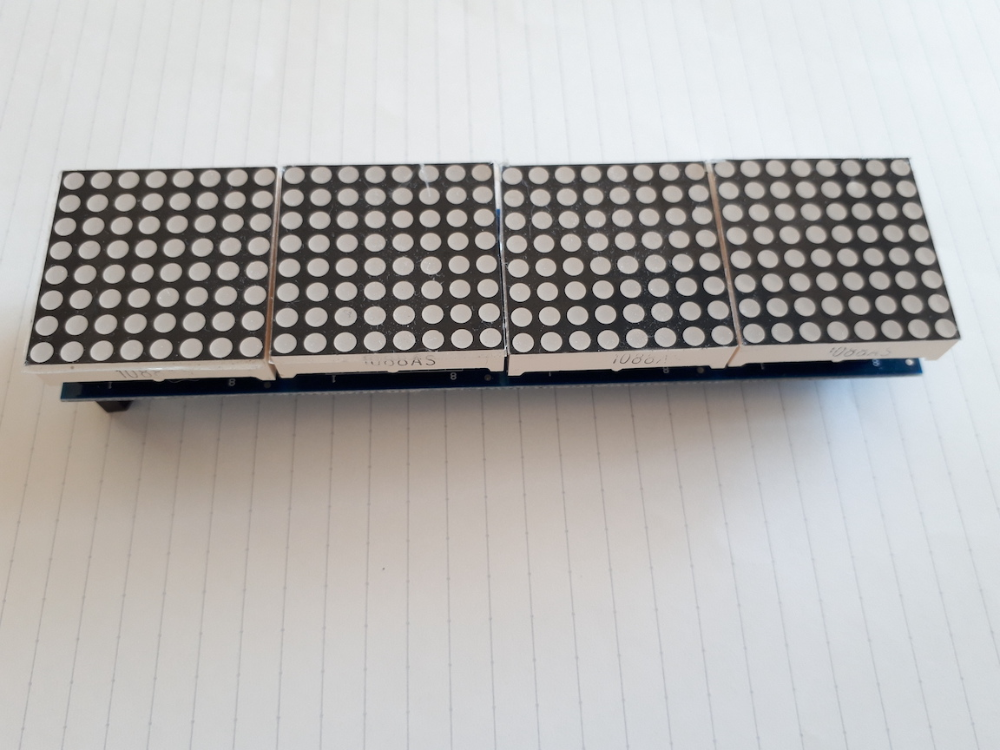

# libLEDMatrix

Library for printing string (or something) on LED-Matrix controled by Max7219.

### Max7219 LED-Matrix
Well-known module. Available on [www.aliexpress.com](https://www.aliexpress.com).



You can extend it by chaining!


### Usage

#### Select H/W
```c
#define SIMULATOR  // simulator on PC (stdout)
#define ARDUINO    // on Arduino (avr)
```

#### Make Buffer and Matrix
see:

- Arduino
    - libLEDMatrix.ino
- Simulator (PC)
    - simulator/libLEDMatrix.cpp
