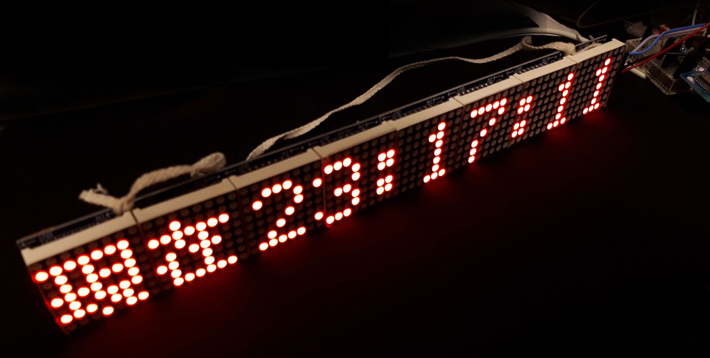
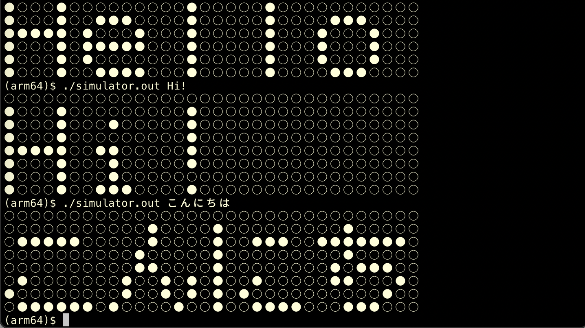
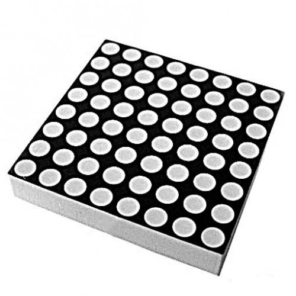

# DotMatrix-LED Library

Library for printing char or string on LED-Matrix.  

Avaiable on arduino projects.  
(Arduino, ESP8266, ...)

## Supported LED Drivers

- Max7219

## Usage

### On Arduino Project

Include "DotMatrixLED.h" in Arduino project.  

<figure style="text-align:center;">
	
	<figcaption>Max7219 modules (using 8 panels)</figcaption>
</figure>


- Simple sketch for Arduino

> examples/ascii/ascii.ino

```cpp
#include <Arduino.h>

#include "DotMatrixLED.h"

Max7219 max7219(5, 4, 13, 0);
MatrixLED matrixLEDs[8];

void setup() {
  testRun(max7219);
  for (uint8_t i = 0; i < 8; ++i) {
    matrixLEDs[i] = MatrixLED(8, 8);
  }

  writeAsciisToMatrixLEDs(matrixLEDs, 7, "Hello!", 0);
}

void loop() {
  static uint8_t cnt = 0;
  (matrixLEDs + 7)->fill(false);
  writeAsciiToMatrixLED(matrixLEDs[7], '0' + cnt, 1);
  max7219.flushMatrixLEDs(matrixLEDs, 8);

  delay(1000);

  if (cnt == 9) {
    cnt = 0;
  } else {
    ++cnt;
  }
}

```


### On Terminal (Simulation)

You can print MatrixLED to stdout.

<figure style="text-align:center;">
	
	<figcaption>Simulation on terminal</figcaption>
</figure>

```cpp:simulator/simulator.cpp
#include <iostream>
#include <cstdint>

#include "DotMatrixLED.h"

const uint8_t matrix_length = 4;
const uint8_t height = 8;
const uint8_t width = 8;
const char on[]  = "●";
const char off[] = "○";

int main(int argc, char **argv) {
  const char *target = (argv[1] == nullptr) ? "Hello" : argv[1];
  
  MatrixLED matrixLEDs[matrix_length];
  for (uint8_t i = 0; i < matrix_length; ++i) {
    matrixLEDs[i] = MatrixLED(height, width);
  }

  writeJISsToMatrixLEDs(matrixLEDs, matrix_length, target, 0);

  for (uint8_t row_i = 0; row_i < height; ++row_i) {
    for (uint8_t matrix_i = 0; matrix_i < matrix_length; ++matrix_i) {
      uint8_t row = *((matrixLEDs + matrix_i)->buffer + row_i);
      for (uint8_t bit_i = 0; bit_i < 8; ++bit_i)
        std::cout << ((row >> (7 - bit_i) & 0b1) ? on : off);
    }
    std::cout << std::endl;
  }
}

```

## Data structure
### MatrixLED.h

```cpp
struct MatrixLED {
  uint8_t width;   // width  <= 8
  uint8_t height;  // height <= 8
  uint8_t buffer[8];  // 8*8 bit = 64 bit = 8 byte
};
```
One MatrixLED represents one matrix panel.

<figure style="text-align:center;">
	
	<figcaption>Matrix panel (8x8)</figcaption>
</figure>

For detail, see `doc/html/index.html`.

--

shirosha2 Jan. 2021